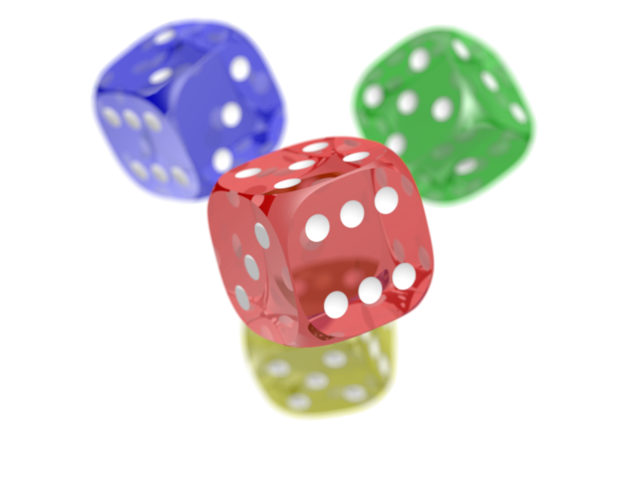

# QOI Image Codec

An encoder/decoder for the [**QOI** ("Quite OK Image")](https://qoiformat.org/) format, a simple and fast lossless image compression format.

Built in **2022** for the **CS-107** course (EPFL), my first programming project. The assignment required implementing a full encoder and decoder for this format on top of a provided skeleton, working at the byte level (bitwise operators, modular arithmetic, hash tables). It was designed as a group project, but I completed it entirely on my own.

This repository has since been refactored to be a standalone, exportable project: everything specific to the course's grading/submission process (the submission script, signature-check tool, IDE project files, etc.) has been removed, and the entry point was turned into a simple command-line tool (see [Compilation](#compilation) below).

## Project structure

```
.
├── Makefile
├── convert              # generated by `make`, the CLI tool
├── consignes.pdf        # original assignment instructions (French)
├── references/          # sample .png / .qoi files for testing
├── res/                 # output of ./convert (created automatically)
├── out/                 # compiled .class files (created by `make`)
└── src/qoi/
    ├── ArrayUtils.java      # array/byte utilities (mine)
    ├── QOIEncoder.java      # QOI encoder (mine)
    ├── QOIDecoder.java      # QOI decoder (mine)
    ├── Main.java            # CLI entry point
    ├── Helper.java          # file/image I/O (provided by the course)
    └── QOISpecification.java # QOI constants & hash function (provided by the course)
```

## How QOI works

QOI is lossless: decoding a `.qoi` file gives back the exact same pixels as the original image, but the file is much smaller than storing every pixel explicitly. The core idea is that in most real images, a pixel is very often identical to, or very close to, the pixel right before it — so instead of storing every pixel in full, most of them can be described much more cheaply relative to their neighbor.

A `.qoi` file has 3 parts:

| Part | Content |
|---|---|
| Header | 14 bytes: magic number `qoif`, width, height, number of channels, color space |
| Data | the actual pixels, compressed (see below) |
| End-of-file marker | fixed signature bytes closing the file |

### The 6 block types ("tags")

Instead of storing every pixel as 4 raw bytes (R, G, B, A), the encoder walks the image pixel by pixel and picks the cheapest possible encoding for each one, identified by a "tag" written in the first bits of the block:

| Tag | Tag bits | What it stores | Size |
|---|---|---|---|
| `QOI_OP_RUN` | `11______` | "the previous pixel repeats N times in a row" | 1 byte |
| `QOI_OP_INDEX` | `00______` | "this pixel is the one at slot *i* in the hash table of recently-seen pixels" | 1 byte |
| `QOI_OP_DIFF` | `01______` | a small per-channel difference (R/G/B) from the previous pixel | 1 byte |
| `QOI_OP_LUMA` | `10______` | a larger difference from the previous pixel, based on how much the green channel changed | 2 bytes |
| `QOI_OP_RGB` | `11111110` | the full pixel, alpha unchanged from the previous one | 4 bytes |
| `QOI_OP_RGBA` | `11111111` | the full pixel, including a new alpha value | 5 bytes |

The encoder always tries them in that order — run, then index, then diff, then luma, then RGB, then RGBA — roughly from cheapest to most expensive: a long run of identical pixels costs almost nothing, while a pixel unlike anything seen before needs the full 4 or 5 bytes.

Concrete examples of each, as produced by this codebase:

- `QOI_OP_RUN` — the previous pixel repeats 41 more times in a row → encoded as the single byte `0b11101000` (`0xE8`): tag `11`, count `101000`
- `QOI_OP_INDEX` — the current pixel matches slot 43 of the hash table → encoded as the single byte `0b00101011` (`0x2B`): tag `00`, index `101011`
- `QOI_OP_DIFF` — R/G/B changed by `(-2, -1, 0)` compared to the previous pixel → encoded as the single byte `0b01000110` (`0x46`): tag `01`, then `dr dg db`
- `QOI_OP_LUMA` — R/G/B changed by `(+19, +27, +20)` compared to the previous pixel → encoded as the 2 bytes `0b10111011 0b00000001` (`0xBB 0x01`): tag `10` + green diff, then `dr-dg`/`db-dg`
- `QOI_OP_RGB` — a brand new pixel `R=100, G=0, B=55` (alpha unchanged) → encoded as the 4 bytes `0b11111110 0b01100100 0b00000000 0b00110111` (`0xFE 0x64 0x00 0x37`): tag byte, then R, G, B
- `QOI_OP_RGBA` — a brand new pixel `R=100, G=0, B=55, A=73` → encoded as the 5 bytes `0b11111111 0b01100100 0b00000000 0b00110111 0b01001001` (`0xFF 0x64 0x00 0x37 0x49`): tag byte, then R, G, B, A

### The hash table trick

While walking the image, the encoder keeps the last 64 distinct pixels it has seen in a small table, indexed by a hash of the pixel's value. If the current pixel is already in that table, it doesn't need to be re-encoded at all: a single `QOI_OP_INDEX` byte pointing at its slot is enough. The decoder rebuilds the exact same table as it decodes, so it can resolve these references back into real pixel values.

### Telling the blocks apart

The first 2 bits of a byte identify which tag it is: `00` = index, `01` = diff, `10` = luma, `11` = run — except that `QOI_OP_RGB` and `QOI_OP_RGBA` also start with `11`, but are reserved as the two highest possible byte values (`0b11111110` and `0b11111111`). That's why a `QOI_OP_RUN` block can never repeat more than 62 pixels at once: capping it at 62 keeps its byte value below those two reserved values, so the decoder is never ambiguous about which tag it's reading.

### From pixels to file, and back

Internally, an image is first split into 4 separate channels (R, G, B, A) and flattened into a single list of pixels (`ArrayUtils.imageToChannels`). The encoder (`QOIEncoder.encodeData`) then walks that list once, left to right, applying the priority order above to each pixel. The decoder does the exact reverse: `QOIDecoder.decodeData` reads the compressed bytes back into that same flattened pixel list, which is then folded back into a normal 2D image (`ArrayUtils.channelsToImage`).

## Compilation

The project is compiled using a `Makefile`, which only recompiles the source files that changed since the last build. Source files are compiled with `javac`.

Requires a JDK (17 or later). Check if you already have one:

```bash
java -version
```

If not, install one:

```bash
# Ubuntu / Debian / WSL
sudo apt install openjdk-17-jdk

# macOS (Homebrew)
brew install openjdk@17

# Windows
# Download and install from https://adoptium.net/
```

The `Makefile` includes the following standard rules:
* `all`: Compiles the project and generates the `convert` executable script.
* `clean`: Removes compiled class files.
* `fclean`: Removes compiled class files and the `convert` script.
* `re`: Recompiles the project from scratch.

To compile and launch:

    make
    ./convert <path_to_image>

The output format (`.png` ↔ `.qoi`) is automatically inferred from the extension of the file passed as argument. Output is always written to the `res/` folder (created automatically if missing). Sample images are available in `references/` for quick testing, e.g. `./convert references/dice.png`.

If the input file doesn't exist or has an unsupported extension, `./convert` prints an error/usage message instead of a file.

## Example

```bash
$ make
$ ./convert references/beach.png
Wrote res/beach.qoi
```

Real numbers on the sample images in `references/`:

| Image | PNG size | QOI size | Difference |
|---|---|---|---|
| `beach` | 3,782,043 bytes | 3,055,136 bytes | 19% smaller |
| `dice` | 279,814 bytes | 360,208 bytes | 29% **bigger** |

QOI is not a strict improvement over PNG: PNG's compression (DEFLATE) is more sophisticated and can win on file size, especially on smaller or more detailed images. QOI's real advantage is speed — it's designed to encode and decode orders of magnitude faster than PNG, sometimes at the cost of a worse compression ratio.

<p align="center"></p>

**Why it gains bytes:** the sky, sand and water are large areas of near-uniform or smoothly-varying color. Consecutive pixels are almost always identical or very close to their neighbor, which is exactly what `QOI_OP_RUN` (exact repeats) and `QOI_OP_DIFF`/`QOI_OP_LUMA` (small gradual changes) are built for — most of the image compresses down to 1-2 bytes per pixel instead of 4.

<p align="center"></p>

**Why it loses bytes:** the translucent, glossy dice create a lot of fine detail — highlights, soft shadows, and semi-transparent edges where the alpha channel itself keeps changing from one pixel to the next. All of QOI's cheap encodings assume the alpha channel stays the same as the previous pixel, so every one of those transitions forces a fallback to the full 5-byte `QOI_OP_RGBA` block instead. PNG's more elaborate compression copes better with that kind of detail.

## What I wrote

The course provided a skeleton (method signatures, plus utility code out of scope for the course); the assignment was to implement the body of these methods across 3 files.

### `src/qoi/ArrayUtils.java` — byte array utilities

- `equals(byte[], byte[])` / `equals(byte[][], byte[][])` — deep array comparison (handling `null` cases)
- `wrap(byte)` — wraps a single byte into an array
- `toInt(byte[])` / `fromInt(int)` — converts between an integer and a 4-byte big-endian array
- `toIntRGBA(byte[])` / `fromIntRGBA(int)` — custom variant to manipulate a pixel directly in `[R, G, B, A]` format
- `concat(byte...)` / `concat(byte[]...)` — concatenates bytes, or arrays of bytes, together
- `extract(byte[], start, length)` — extracts a sub-array from an array
- `partition(byte[], sizes...)` — splits an array into several sub-arrays of given sizes
- `imageToChannels(int[][])` — decomposes an image (ARGB pixels) into a linearized array of `[R, G, B, A]` channels
- `channelsToImage(byte[][], height, width)` — reverse operation: rebuilds the 2D image from the channels

### `src/qoi/QOIEncoder.java` — QOI encoder

- `qoiHeader(Image)` — builds the file header (magic number, dimensions, channels, color space)
- `qoiOpRGB(byte[])` / `qoiOpRGBA(byte[])` — encodes a full pixel (with or without the alpha channel)
- `qoiOpIndex(byte)` — encodes a reference to a pixel already seen (hash table)
- `qoiOpDiff(byte[])` — encodes a small difference between two consecutive pixels
- `qoiOpLuma(byte[])` — encodes a larger difference, based on the variation of the green channel
- `qoiOpRun(byte)` — encodes a run of identical, repeated pixels
- `encodeData(byte[][])` — main algorithm: walks the image pixel by pixel and picks the best encoding at each step
- `qoiFile(Image)` — assembles header + encoded data + end-of-file signature

### `src/qoi/QOIDecoder.java` — QOI decoder

- `decodeHeader(byte[])` — extracts width/height/channels/color space from the header
- `decodeQoiOpRGB(...)` / `decodeQoiOpRGBA(...)` — decodes a full pixel
- `decodeQoiOpDiff(...)` / `decodeQoiOpLuma(...)` — rebuilds a pixel from an encoded difference
- `decodeQoiOpRun(...)` — repeats a pixel N times in the output buffer
- `decodeData(byte[], width, height)` — main decompression algorithm, rebuilds every pixel of the image
- `decodeQoiFile(byte[])` — rebuilds a full Java image from the binary content of a QOI file

### The rest

- `src/qoi/Main.java` — command-line entry point (`./convert <file>`), which simply calls the methods above.
- `src/qoi/Helper.java`, `src/qoi/QOISpecification.java` — code provided by the course (file/image I/O, QOI format constants, hash function): not written by me, but required to build and run the project.

## Credits

- The [QOI ("Quite OK Image") format](https://qoiformat.org/) was created by Dominic Szablewski.
- The assignment skeleton and specification (`consignes.pdf`) are by Hamza Remmal, Barbara Jobstmann and Jamila Sam, for EPFL's CS-107 course.
